# PwnBox-Kali Configuration:

## Panel Configuration:

### CPU Graph:
* Right click on the panel and select `Add New Item`  

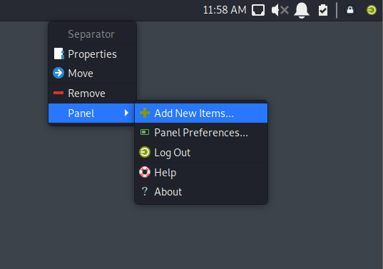

* On the search bar search CPU graph and click add  

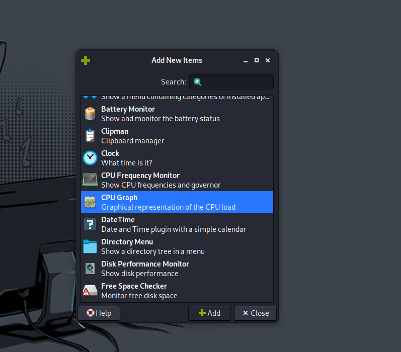

* Right click on the `Graph` icon and move it to the left side of the panael  
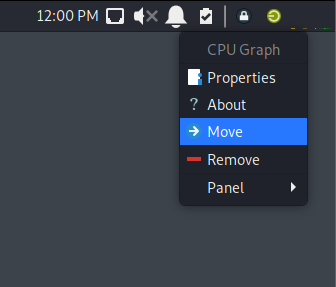

* Right click on the `Graph` icon and change the properties to:  

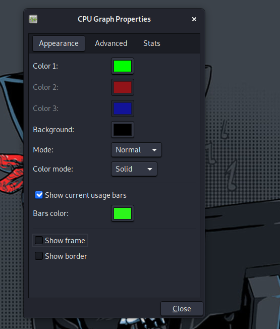

 

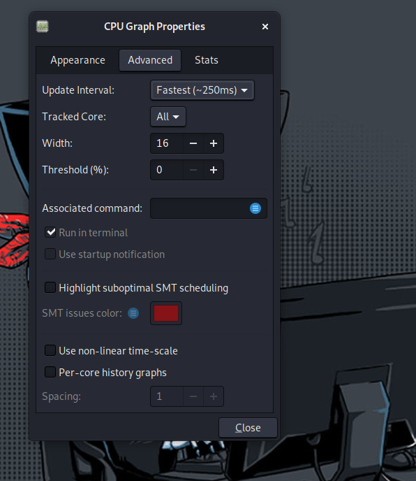

* Remove workspace-switcher  
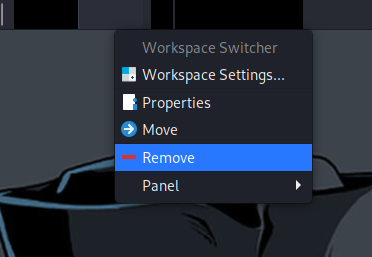 

### Separators:
* Right click on the seperator and change is properits  

* Move the seperator to the right side of the panael  

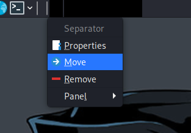

 

* Do the same to the second separator and place it next to the cpu graph on the right side  

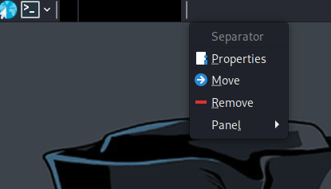

* Add New separator and place it next to the clock icon  

### Clock Format:
* Right click on the clock icon and select properties  

### Panel Icons:

* Remove show desktop icon  

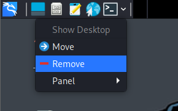

* change directory menu properties by right click  

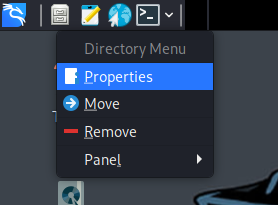

* change them to:  

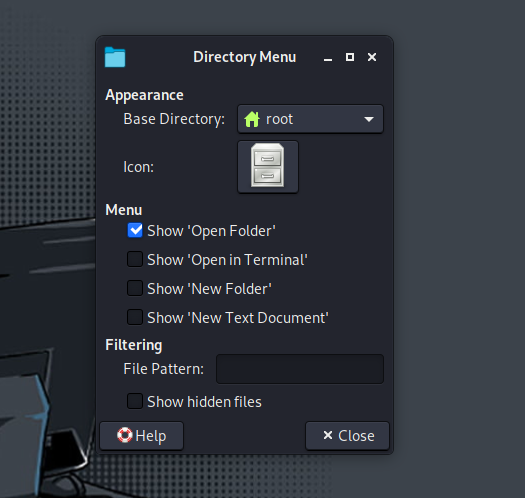

* Remove gedit launcher and Internet icon by right click and select remove  

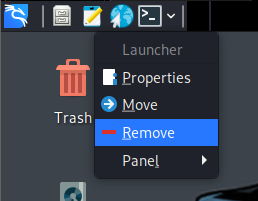

 

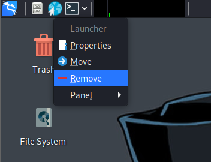

* add new item and search for laucher  

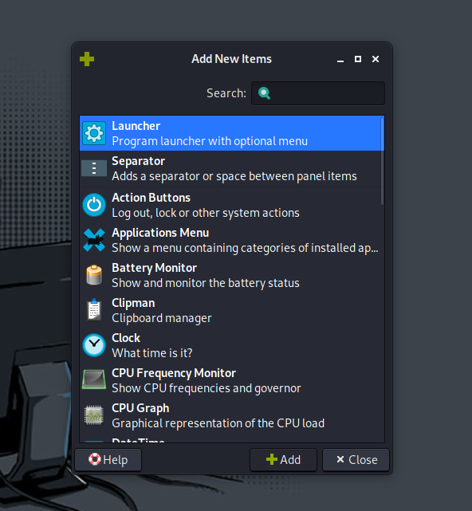 

* Change launcher properties by right click  
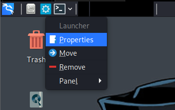

* Click on the `+` icon and search firefox  

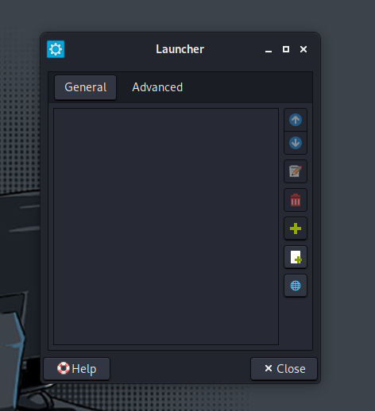

 

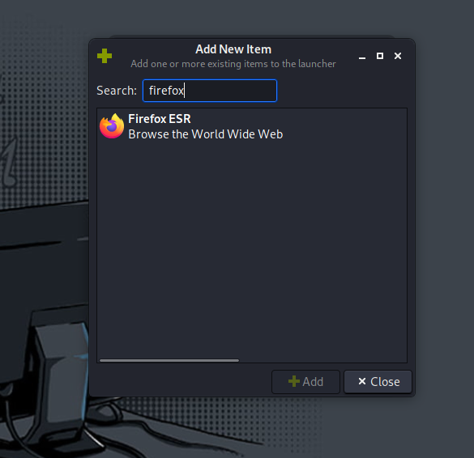

* add new launcher and insted of click on `+` click on `paper and +` icon  
* add the following command: `gnome-terminal -e pwsh`  

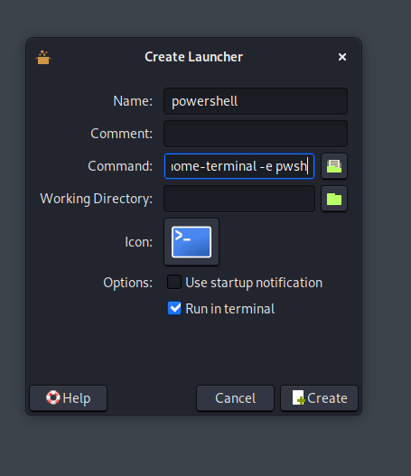

* change the icon by clicking it and select from the list `image file` and eneter the following path `/opt/Customize-Kali/htb`   

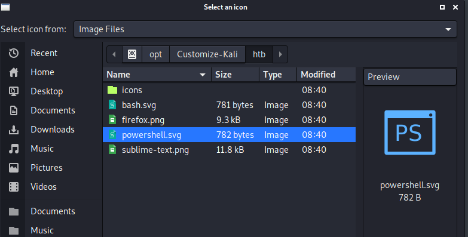

* change termial icon by right click select properites click on icon   
* from the list select `Application icon` and select kali-menu   

### VPN Monitor:
* add new item and select `Generic Monitor`   

* Right click on the `xxx` icon and change propeties  
* set the command `/opt/Customize-Kali/htb/vpnpanel.sh`   

 

---

## Desktop Settings: 

* Right click on the dekstop and select dekstop settings   

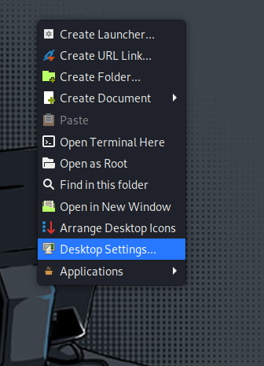

* Go to the icon tab and chage to the following:   

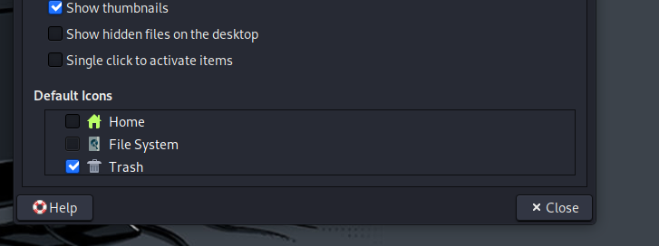

---

## Startup Apps:

* Go to settings manager   

* Go to `Session And Startup`

* Click on `+` icon and set the command `plank`   

* Set up login banner by clicking on `+` icon and set the command `gnome-terminal -e /opt/Customize-Kali/htb/banner.sh`   

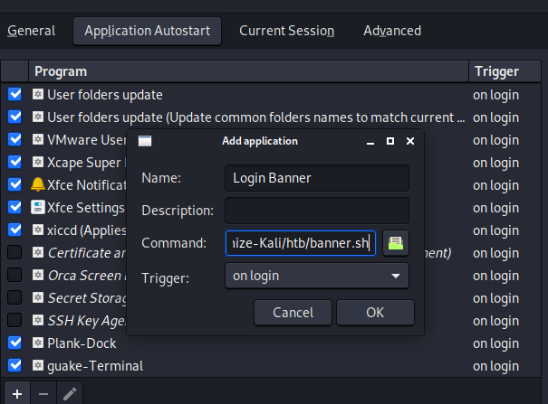

* Set up guake termianl startup by clicking on `+` icon and set the command `guake`   

---

## Guake Configuration:

* on the terminal type guake and right click on guake icon on the right side   

* In `General` tab set the following config:   

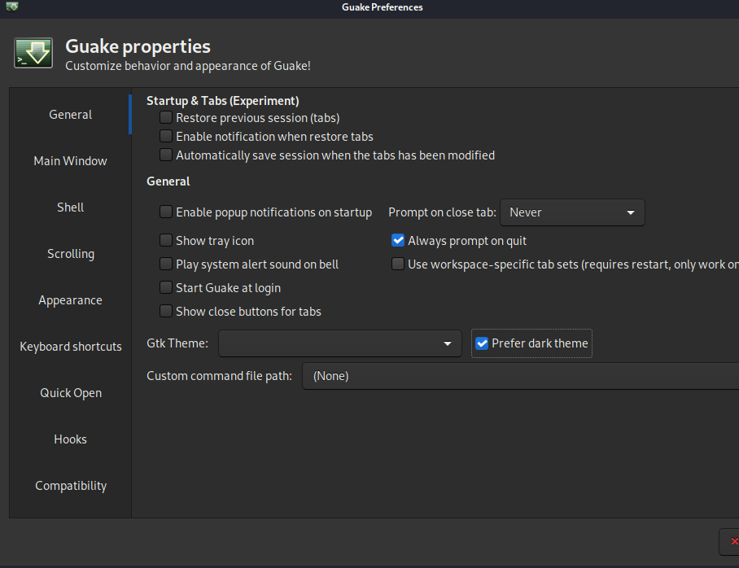

* In `Main Windows` tab set the following config:   

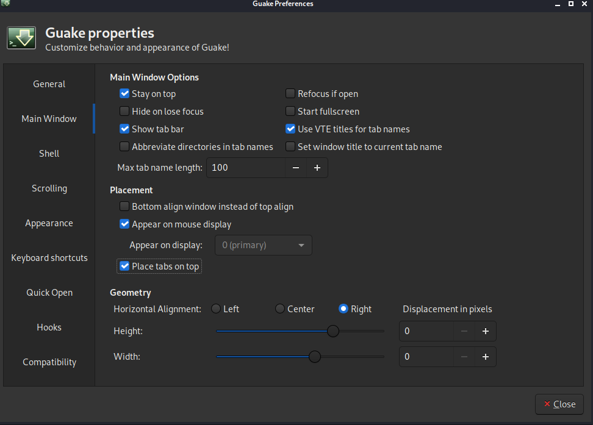

* In `Appearence` tab set the following config:   

* In `keyborad Shortcuts` tab set the following config:   

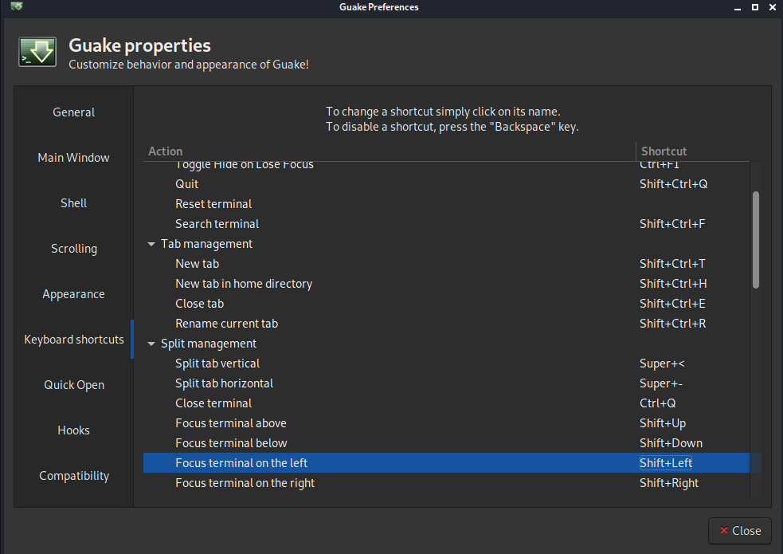

---

## Default App:

* Go to settings and click on `Default Application` and on utiliti tab change to `gnome terminal`   

---

## Plank Doc

* On the terminal type plank and hit enter and edit this has you like this is mine:   

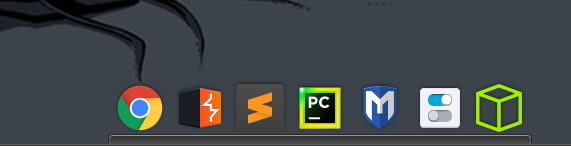

---

## Terminal Configuration:

* Open terminal and right clikc on it and select `Preferences` and change to the following:   

* go to `color` tab and change to the following:   

---

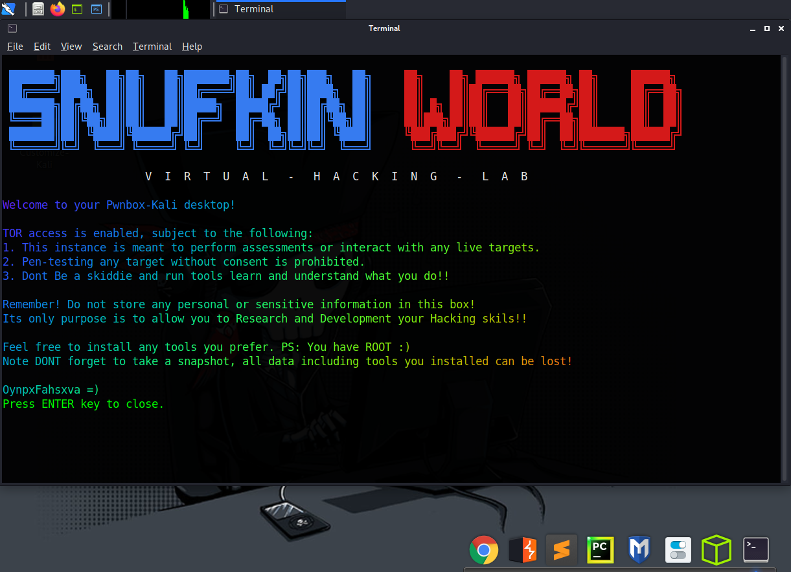